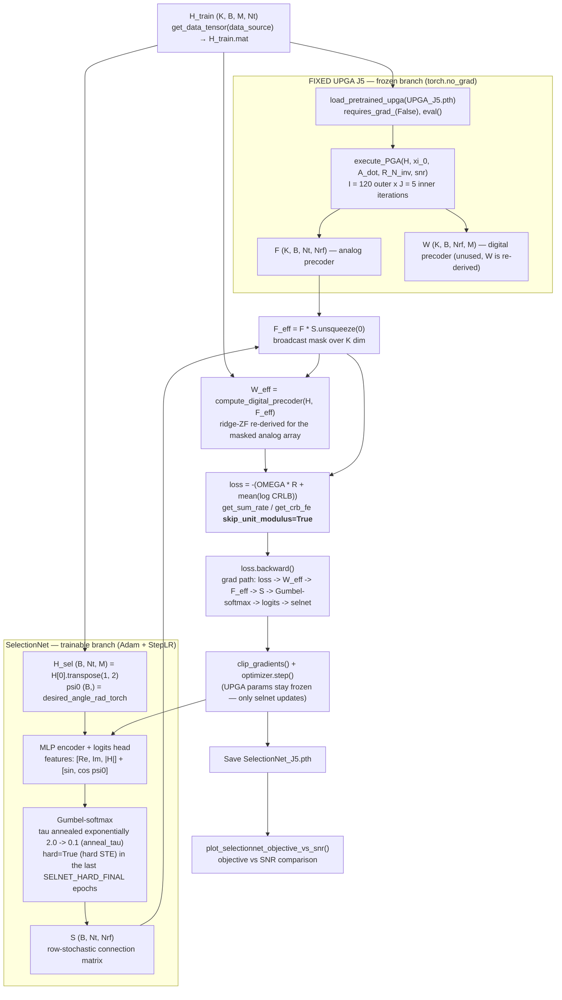

# Training SelectionNet

Learnable antenna-to-RF-chain assignment for the sub-connected mmWave massive MIMO ISAC hybrid beamforming system.

## What it does

`SelectionNet` (`SelectionNet.py`) is an MLP that maps the channel `H` and a sensing
direction `psi0` to a connection matrix `S` of shape `(batch, Nt, Nrf)`. Each row of
`S` is a soft/hard distribution over the RF chains: antenna `n` is assigned to the RF
chain with the largest entry. This replaces the fixed hand-built sub-connected mask
(e.g. `generage_partial_connection_mask` in `utility.py:458`) with a **learned,
per-sample mask**.

Because there is no ground-truth assignment, the network is trained with the same
**unsupervised physics loss** used for the UPGA step sizes. `main_selection.py` writes it
out explicitly (equivalent to `get_sum_loss` in `PGA_models.py:890`) so rate and CRB can
be watched independently:

```
sum_rate = get_sum_rate(H, F_eff, W_eff, snr, skip_unit_modulus=True)
crb      = get_crb_fe(H, F_eff, W_eff, xi_0, A_dot, R_N_inv, snr, skip_unit_modulus=True)
loss = -(OMEGA * sum_rate + torch.mean(crb))
```

Two design choices make this loss actually sensitive to the learned mask `S`:

- **`skip_unit_modulus=True`.** The loss functions call `normalize()`, which by default
  divides `F` by `|F|` to enforce constant modulus. For a masked precoder `F_eff = F*S`
  with `|F| = 1` this collapses the mask (`|F*S| = S`, so `F*S / |F*S| ≈ F`) and erases
  both the mask amplitude and its gradient. Skipping it keeps the masked magnitudes
  intact (`utility.py:381-391`).
- **`REDERIVE_DIGITAL_W = True` (`main_selection.py:34`).** `W` is re-derived with
  `compute_digital_precoder(H, F_eff)` (`utility.py:433`) — a differentiable ridge-ZF
  for the **masked** effective channel `H F_eff`. A `W` frozen from the full-connected
  UPGA is structurally mismatched to the masked array, and after power normalization
  the objective becomes nearly independent of `S` (flat loss, no gradient).

## Block diagram



Key idea: the **UPGA is fixed** first — it only supplies F for the loss. W from the UPGA
is discarded and re-derived for the masked array. Only the mask S comes from a trainable
path, so backprop reshuffles the antenna→RF-chain
assignment without touching the beamformer.

## The training flow (main_selection.py)

The training loop lives in `main_selection.py`, function `run_selectionnet()`.
Step by step:

1. **Load data.** `H_train` has shape `(K, B, M, Nt)` (K = frequency bands, B = batch,
   M = users, Nt = antennas), confirmed from `matlab/comm_data.m`. With
   `data_source = 'matlab'` the channels are read from `dataset/64TX_4UE_4RF/H_train.mat`
   (`utility.py:606`).

2. **Build a frozen beamformer.** `load_pretrained_upga()` re-instantiates the exact
   `PGA_Unfold_JX` class with the same `step_size` shape used in its own training
   (`(J, n_iter_outer, K+1)`), loads `model/64TX_4UE_4RF/UPGA_J5.pth`, sets
   `requires_grad_(False)` and `eval()`. This gives the fixed F, W that the loss needs.

3. **Per batch:**
   - Take channels `H_batch` of shape `(K, B, M, Nt)`.
   - Reformat for SelectionNet: `H_sel = H_batch[0].transpose(1, 2)` → `(B, Nt, M)`.
   - `psi0` is the fixed sensing direction `desired_angle_rad` replicated over the batch.
   - **SelectionNet forward:** `S, logits = selnet(H_sel, psi0, tau, hard=hard_mode)`.
     For most epochs `hard=False` (soft Gumbel-softmax), so gradients can flow, and
     `tau` decays exponentially over epochs (`anneal_tau`, 2.0 → 0.1) so the mask
     sharpens toward one-hot as training progresses. For the last
     `SELNET_HARD_FINAL = 5` epochs `hard=True` (straight-through estimator) with `tau`
     frozen at `SELNET_TAU_END`, closing the train/eval discretisation gap.
   - **Physics forward (no grad):** the frozen UPGA runs `execute_PGA(...)` to produce
     `F` of shape `(K, B, Nt, Nrf)` (its `W` is computed but ignored).
   - **Apply the learned mask:** `F_eff = F * S.unsqueeze(0)` broadcasts `S` over the
     K dimension, zeroing every antenna→RF-chain path the network did not select.
   - **Re-derive the digital precoder:** `W_eff = compute_digital_precoder(H_batch, F_eff)`
     (ridge-ZF matched to the masked effective channel, `utility.py:433`). This is
     differentiable w.r.t. `S`, so the assignment gradient is preserved. Skipped if
     `REDERIVE_DIGITAL_W = False`, in which case the frozen `W` is used.
   - **Loss:** computed from the decomposed physics terms with
     `skip_unit_modulus=True` (keeps the mask amplitude/gradient from being erased by
     the unit-modulus projection inside `normalize()`):
     ```python
     sum_rate = get_sum_rate(H_batch, F_eff, W_eff, snr_train, skip_unit_modulus=True)
     crb      = get_crb_fe(H_batch, F_eff, W_eff, xi_0, A_dot, R_N_inv, snr_train,
                          skip_unit_modulus=True)
     loss = -(OMEGA * sum_rate + torch.mean(crb))
     ```
   - **Backprop:** `loss.backward()` — the gradient path is
     `loss → (get_sum_rate | get_crb_fe) → W_eff → F_eff → S → gumbel_softmax → logits → selnet`.
     Only `selnet.parameters()` are updated; F, W are detached by the `no_grad` block.
     Gradients are clipped (`clip_gradients`, max_norm 1.0) and the optimizer steps with
     a StepLR scheduler (halves the LR every `SELNET_SCHEDULER_STEP = 10` epochs).
   - Optionally add a load-balancing regularizer:
     `loss += SELNET_LOAD_BALANCE_WEIGHT * selnet.column_load(S).std(dim=-1).mean()`
     (off by default, `SELNET_LOAD_BALANCE_WEIGHT = 0.0`).

4. **Save & plot.** After all epochs, the state dict is saved as
   `SelectionNet_J5.pth` in `model/64TX_4UE_4RF/`, and a loss-vs-epoch curve is written
   to `SelectionNet_loss.png`.

5. **Sanity check.** A hard-mode (`hard=True`, `tau=0.05`) forward on a small batch
   prints the number of antennas assigned to each RF chain via
   `selnet.column_load(S_hard)` and verifies the total equals `Nt`.

6. **Objective-vs-SNR evaluation.** `plot_selectionnet_objective_vs_snr()` sweeps the
   SNR points in `snr_dB_list` and plots the physics objective
   `J = OMEGA * R + mean(log CRLB)` for three schemes that share the *same* frozen
   UPGA J5 beamformer (F) and differ only in the antenna→RF-chain mask applied to F.
   For fairness all three re-derive `W` with `compute_digital_precoder(...)` for their
   own masked `F_eff` (the same `REDERIVE_DIGITAL_W` protocol as training):
   - **SelectionNet** — per-sample learned mask `S_hard` from the trained network
     (hard one-hot mode).
   - **Fixed sub-connected** — the uniform block mask `generage_partial_connection_mask`
     (`Nt/Nrf` antennas per RF chain).
   - **Full-connected** — no mask at all (F is used directly).
   The figure is written to
   `sim_results/64TX_4UE_4RF/objective_vs_SNR_SelectionNet_64_0.25.png/.eps`.

### Gradient flow (why it works)

```
loss ──> get_sum_rate / get_crb_fe ──> W_eff = compute_digital_precoder(H, F_eff)
   │                                            │
   │                                            └─> F_eff = F * S ──> S (gumbel-softmax) ──> selnet parameters (trained)
   │
   └── frozen UPGA (no_grad) ───> F (detached)
```

- The Gumbel-softmax makes the discrete assignment differentiable via the
  reparameterization trick (Gumbel noise added to logits, then row-wise softmax).
- The straight-through estimator in `hard` mode returns one-hot values on the forward
  pass but keeps soft-probability gradients on the backward pass.
- `compute_digital_precoder` is differentiable in `F_eff`, so W re-derivation is simply
  another link on the path `S → F_eff → W_eff → loss`, not a gradient blocker.
- `skip_unit_modulus=True` prevents the unit-modulus re-normalization inside
  `normalize()` from dividing the mask out of `F_eff` (which would flatten the gradient).
- Since the UPGA is frozen, only the assignment network learns — the beamformer itself
  is fixed and the network only reshuffles which antennas connect to which RF chains.

## How to run it

Requirements: Python 3.10+, PyTorch 2.x, and the existing repo data
(`dataset/64TX_4UE_4RF/H_train.mat` — used when `data_source = 'matlab'`) plus a
pre-trained UPGA checkpoint (`model/64TX_4UE_4RF/UPGA_J5.pth`).

1. **Enable the run flag.** In `system_config.py`, make sure:
   ```python
   run_SelectionNet = 1
   ```
   (Already set to 1. Set to 0 to skip SelectionNet training.)

2. **Optionally tune hyper-parameters** at the top of `main_selection.py`:
   ```python
   SELNET_LR = 1e-3        # Adam learning rate for the assignment network
   SELNET_TAU_START = 2.0  # Gumbel temperature at epoch 0 (exploration)
   SELNET_TAU_END = 0.1    # Gumbel temperature at the last epoch (sharpen)
   SELNET_LOAD_BALANCE_WEIGHT = 0.0  # >0 enables the load-balancing regularizer
   SELNET_HARD_FINAL = 5   # last N epochs use hard STE to match evaluation
   SELNET_SCHEDULER_STEP = 10  # StepLR epoch interval (gamma = 0.5)
   REDERIVE_DIGITAL_W = True  # re-derive W (ridge-ZF) for the masked analog network
   ```
   Epochs, batch size, learning rate etc. come from `system_config.py`
   (`n_epoch`, `batch_size`, `learning_rate`).

3. **Run the script:**
   ```bash
   python main_selection.py
   ```
   Recommended (safe) run:
   ```bash
   python main_selection.py 2>&1 | tee selection_train.log
   ```
   Note: training runs the full physics forward pass per batch (120 outer × 5 inner
   UPGA iterations), so it is expensive. On a machine without a GPU, reduce
   `n_epoch`, `n_iter_outer`, or `n_iter_inner_J5` in `system_config.py`, and ensure
   `device` resolves to CPU (printed at import from `system_config.py:11`).

4. **Outputs.**
   - `model/64TX_4UE_4RF/SelectionNet_J5.pth` — trained weights (state dict)
   - `model/64TX_4UE_4RF/SelectionNet_loss.png` — loss curve
   - `sim_results/64TX_4UE_4RF/objective_vs_SNR_SelectionNet_64_0.25.png/.eps` —
     post-training objective-vs-SNR comparison (SelectionNet vs fixed
     sub-connected vs full-connected)
   - `selection_train.log` — console output (if you used the `tee` command)

## Files involved

| File                | Role                                                                  |
|---------------------|-----------------------------------------------------------------------|
| `SelectionNet.py`   | The MLP + Gumbel-softmax discretization (module only, no loss)         |
| `main_selection.py` | The unsupervised training loop                                         |
| `system_config.py`  | `run_SelectionNet` flag, system & training hyper-parameters            |
| `PGA_models.py`     | `PGA_Unfold_JX` (frozen beamformer) and the physics loss terms          |
| `utility.py`        | `get_data_tensor` (data loading), `get_sum_rate` / `get_crb_fe` / `normalize` (physics loss), `compute_digital_precoder` (re-derived W), `generage_partial_connection_mask` (fixed mask) |
