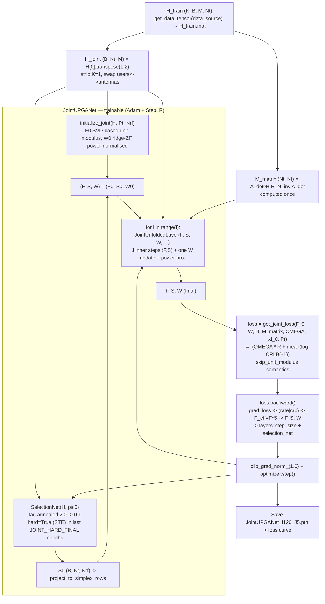

# JointUPGANet — Joint Deep-Unfolding Hybrid Beamforming

Learnable antenna-to-RF-chain connectivity **optimised inside** the same unfolded
projected-gradient-ascent (PGA) iteration as the analog precoder, for the
sub-connected mmWave massive MIMO ISAC hybrid beamforming system.

## What changed vs. the existing pipeline

The legacy pipeline (`PGA_models.py`, `SelectionNet.py`) separates the two jobs:

- `PGA_Unfold_JX` unfolds the gradient ascent over the **analog precoder F and
  digital precoder W** only, with a **fixed** sub-connected mask (either the
  hand-built `generage_partial_connection_mask` or the trained `SelectionNet`).
- `SelectionNet` learns the antenna→RF-chain mask `S` in a **separate** training
  stage, with the beamformer frozen (`main_selection.py`).

`JointUPGANet` fuses both into a single trainable network: the connection matrix
`S` becomes an additional decision variable of the *same* unfolded iterations as
`F` and `W`. There is no front-end/frozen-beamformer split anymore — one
unsupervised physics loss trains everything jointly.

The physics gradients that the new network calls are the **same** hand-derived
formulas as the legacy `PGA_models.py`, re-expressed in a frequency-single
(`K = 1`), batch-only tensor layout (see [Physics](#physics)).

## What it optimises

The objective is the same ISAC trade-off as the rest of the repo:

```
g(F, W, S) = omega * R(F_eff, W) + log( CRLB(F_eff, W)^-1 )

F_eff = F ⊙ S      (Hadamard product)
```

- `F` : complex analog precoder, `(B, N_antennas, N_rf)`, unit modulus on active entries.
- `S` : real row-stochastic connection matrix, `(B, N_antennas, N_rf)`, each row sums to 1.
- `W` : complex digital precoder, `(B, N_rf, N_users)`.
- `R` : sum rate (comm), `log(CRLB^-1)` : sensing Fisher-information term.
- `omega` : comm/sensing weight (from `system_config.OMEGA`).

## Architecture

Two initial-connection schemes are supported (chosen via the ``s_init``
constructor argument):

```
JointUPGANet (s_init = 'selection' | 'fixed')
├── selection_net (SelectionNet)
│     └── used when s_init='selection': S_0 = SelectionNet(H, psi0)
├── fixed_s0  (buffer, built when s_init='fixed')
│     └── the block-diagonal mask (every RF chain serves N_antennas/N_rf antennas)
└── layers : nn.ModuleList of I = n_outer JointUnfoldedLayer
      each layer owns a learnable step_size : (J, 3) slice
        ├── step_size[j, 0] : per-inner-step step size for F
        ├── step_size[0, 1] : step size for S (once per outer iteration)
        └── step_size[0, 2] : step size for W (once per outer iteration)
      (the full [J, I, 3] tensor is defined in system_config.step_size_joint and
       passed into the constructor, mirroring PGA_Unfold_JX's step_size tensor)
```

Both schemes run the same I×J unfolding after S_0 is set; only the source of the
initial connection matrix differs.

### One JointUnfoldedLayer (one outer iteration, `joint_upganet.py:221`)

For each of the `J = n_inner` inner steps (F_hat / S_hat are the "hat" variables
of the inner loop):

1. `F_eff = F_hat * S_hat` (elementwise).
2. `grad_F_eff = omega * get_grad_F_com(H, F_eff, W) + get_grad_F_crb(F_eff, W, M_matrix)`
   — the objective gradient w.r.t. the **effective** precoder, computed once and reused.
3. Chain rule through `F_eff = F ⊙ S` (S real):
   ```
   grad_F = S_hat * grad_F_eff                                    (complex)
   grad_S = real( conj(F_hat) * grad_F_eff )                       (real)
   ```
   Both use PyTorch's conjugate-Wirtinger convention, so there is **no factor 2** on
   `grad_S` (an earlier factor-2 was dropped after the gradient check — see
   [Gradient correctness test](#gradient-correctness-test-test_gradientspy)).
4. `F_hat ← F_hat + step_size[j, 0] * grad_F`.
5. Project: `F_hat ← F_hat / |F_hat|` (unit modulus).

After the inner F loop, the connection matrix is updated **once** per outer
iteration (not inside the inner loop):

6. `S_hat ← S_hat + step_size[0, 1] * grad_S` (gradient from the last inner step),
   then `S_hat ← project_to_simplex_rows(S_hat)`.

Finally the digital precoder is updated once:

7. `grad_W = omega * get_grad_W_com(H, F_eff_new, W) + get_grad_W_crb(F_eff_new, W, M_matrix)`.
8. `W_new ← W + step_size[0, 2] * grad_W`, then power projection so
   `||F_eff_new @ W_new||_F^2 == P_BS`.

### The full network forward (`joint_upganet.py:380`)

```
forward(F0, W0, H, psi0, M_matrix, omega, P_BS, tau=1.0, hard=False)
  if s_init == 'fixed':
      S = fixed_s0.expand(B, -1, -1)        # block sub-connected mask, shared over batch
  else:
      S0, _ = selection_net(H, psi0, tau=tau, hard=hard)   # Gumbel-softmax connection matrix
      S     = project_to_simplex_rows(S0)                  # defensive re-projection
  (F, W) = (F0, W0)
  for layer in layers:  F, S, W = layer(F, S, W, H, psi0, M_matrix, omega, P_BS)
  if hard:  S = one_hot(S)                  # hard sub-connected mask at eval
  return F, S, W
```

Only the step sizes (`step_size` of every layer) and the
`SelectionNet` weights are learnable; `F0` / `W0` are re-initialised from the
channel per batch (same philosophy as the legacy `initialize()`).

> **Hard sub-connected mask at evaluation.** The unfolded layers refine `S` as a
> *soft* row-stochastic matrix (rows sum to 1). If that soft `S` is used directly
> at evaluation, `F_eff = F ⊙ S` behaves like a (partially) full-connected
> precoder and the joint model's objective collapses onto the full-connected
> curve. Passing `hard=True` rounds each row of `S` to a one-hot (one RF chain
> per antenna), restoring the genuine sub-connected structure the network is
> meant to produce. This mirrors the `selection` variant's `hard=True` eval
> protocol and is what `main_SNR_joint.py` / `main_iter_joint.py` use.

### Soft vs. hard `S` during training

Inside every `JointUnfoldedLayer`, `S` is **always soft** (row-stochastic,
refined by gradient ascent). Whether the `S` *returned by `forward`* is soft or
hard depends on the `hard` flag, which is applied **once at the end of `forward`**
via a straight-through estimator (STE):

```python
if hard:
    winners = S.argmax(dim=-1)          # (B, Nt)
    S_hard = torch.zeros_like(S)
    S_hard.scatter_(-1, winners.unsqueeze(-1), 1.0)
    S = S_hard - S.detach() + S         # STE: hard value, soft grad
```

The STE makes the **forward value** of the returned `S` a hard one-hot, while the
**gradient still flows through the soft `S`** (argmax is non-differentiable, so
without this the mask would get zero gradient and never learn a good hard mask).

`main_train_joint.py` sets `hard_mode` as follows:

- **`fixed` variant**: `hard_mode = True` from **epoch 0** — the returned `S` is
  hard (one-hot, via STE) for the whole training run. This keeps the training
  objective consistent with evaluation and avoids an abrupt soft→hard loss jump.
- **`selection` variant**: `hard_mode = False` for most epochs (returned `S` is
  soft), then `hard=True` in the last `JOINT_HARD_FINAL = 5` epochs (with `tau`
  pinned to `JOINT_TAU_END`).

So the statement "S is always soft during training" is only true *inside the
unfolded layers*; the final `S` handed to the loss is hard (one-hot) for the
`fixed` variant throughout, and for the `selection` variant only in the final
epochs.

**Is the argmax hardening at evaluation correct?** Yes. `main_iter_joint.py`
(line 73) and `main_SNR_joint.py` harden the soft `S` with the same
`argmax → one-hot` operation the model's own `forward` applies with `hard=True`,
so the evaluation protocol is exactly consistent with training. In
`main_iter_joint.py` the manual unroll hardens `S` **only for the tracked
objective** while keeping the soft `S` for the next layer — mirroring the STE
training path (hard forward value, soft gradient).

## Physics

All four gradient functions and the two metric functions are faithful, layout-only
adaptations of the legacy `PGA_models.py` / `utility.py` code (verified to agree to
~1e-7, see [Verification](#verification)).

| Function (`joint_upganet.py`)          | Legacy source                          | Layout                                        |
|----------------------------------------|----------------------------------------|-----------------------------------------------|
| `get_grad_F_com` (sum-rate gradient)   | `PGA_models.get_grad_F_com`            | `H (B, Nt, M)`, `F (B, Nt, Nrf)`, `W (B, Nrf, M)` |
| `get_grad_W_com` (sum-rate gradient)   | `PGA_models.get_grad_W_com`            | same                                         |
| `get_grad_F_crb` (log CRLB^-1 grad.)   | `PGA_models.get_grad_F_crb`            | + `M_matrix (Nt, Nt)`                        |
| `get_grad_W_crb` (log CRLB^-1 grad.)   | `PGA_models.get_grad_W_crb`            | + `M_matrix (Nt, Nt)`                        |
| `get_sum_rate_joint`                   | `utility.get_sum_rate` (K = 1)         | `H (B, Nt, M)`                               |
| `get_crb_joint`                        | `utility.get_crb_fe` (K = 1)           | + `M_matrix (Nt, Nt)`, `xi_0`                |
| `get_joint_loss`                       | `PGA_models.get_sum_loss`              | `-(omega * R + mean(log CRLB^-1))`           |
| `initialize_joint`                     | `utility.initialize` (svd)             | SVD-based unit-modulus F0 + ridge-ZF W0      |

Important conventions:

- The channel stays in **antenna-first** layout `H (B, N_antennas, N_users)` (the
  layout `SelectionNet` expects). The comm gradient/rate functions transpose it
  internally to users-first where the physics lives.
- `M_matrix` is the sensing Fisher-like matrix in **antenna space**,
  `M_matrix = A_dot^H R_N_inv A_dot`, shape `(Nt, Nt)`, shared across the batch
  (the same quantity the legacy CRLB functions build internally). `get_grad_F_crb`
  evaluates `M_matrix @ F @ W @ W^H / trace(W^H F^H M_matrix F W)`.
- `get_sum_rate_joint` / `get_crb_joint` use `skip_unit_modulus=True` semantics
  (they never divide `F_eff` by `|F_eff|`), so the `S` mask and its gradient are
  not erased by the unit-modulus projection — exactly the fix documented for
  `SelectionNet` in `SELECTIONNET_TRAINING.md`.
- The loss functions power-normalize `W` (so `||F_eff W||_F^2 = Pt`), idempotent
  with the layer's own power projection.

## Training flow (`main_train_joint.py`)



Step by step:

1. **Load data.** `H_train` is `(K, B, M, Nt) = (1, 4480, 4, 64)` from
   `dataset/64TX_4UE_4RF/H_train.mat` (`data_source = 'matlab'`).
2. **Pre-compute** the shared `M_matrix = A_dot^H R_N_inv A_dot` `(Nt, Nt)`.
3. **Per batch** (`batch_size` = 280 by default, balanced over `snr_dB_list`):
   - Reformat the channel to the model layout `H_joint (B, Nt, M)`.
   - Draw per-sample `Pt` (transmit power `10^(snr_dB/10)`) for this batch.
   - `F0, W0 = initialize_joint(H_joint, Pt, Nrf)` — fresh per batch.
   - `F, S, W = model(F0, W0, H_joint, psi0, M_matrix, OMEGA, Pt, tau, hard)`.
   - `loss = get_joint_loss(F, S, W, H_joint, M_matrix, OMEGA, xi_0, Pt)`.
   - `loss.backward()`, clip to norm 1.0, `optimizer.step()`.
   - Gumbel temperature `tau` anneals exponentially `2.0 → 0.1`; the last
     `JOINT_HARD_FINAL = 5` epochs use `hard=True` (straight-through) so the
     forward mask matches the evaluation protocol.
4. **Save** `model/64TX_4UE_4RF/JointUPGANet_I120_J5.pth` and the loss-vs-epoch
   curve.

## Plotting

### Objective / rate / CRLB vs SNR (`main_SNR_joint.py`)

1. Loads the trained JointUPGANet checkpoint and the baseline models (frozen
   UPGA `UPGA_J5.pth` and trained `SelectionNet_J5.pth`), then sweeps `snr_dB_list`.
2. For each SNR:
   - **JointUPGANet**: re-initialises `F0, W0`, runs the full network with
     `tau=0.05, hard=True`, then computes `R` (`get_sum_rate_joint`) and
     `CRLB = exp(-log(CRLB^-1))`.
   - **Baselines** (frozen UPGA beamformer `F`, `skip_unit_modulus=True` — same
     protocol as `main_selection.py`):
     - *Full-connected HBF*: `F_eff = F`, and `W = W_up` (the UPGA's own
       optimized digital precoder — the full-connected case is the upper bound,
       so it must not be re-derived with ridge-ZF).
     - *Fixed sub-connected*: `F_eff = F * fixed_mask`, `W` re-derived via
       `compute_digital_precoder` (matched to the masked array).
     - *Adaptive connected*: `F_eff = F * S_hard` (trained SelectionNet mask),
       `W` re-derived via `compute_digital_precoder`.
3. Writes four curves per figure to `sim_results/64TX_4UE_4RF/`:
   - `JointUPGANet_obj_vs_SNR_64_0.25.png`  — `J = OMEGA*R + log(CRLB^-1)`
   - `JointUPGANet_rate_vs_SNR_64_0.25.png` — sum rate
   - `JointUPGANet_CRB_vs_SNR_64_0.25.png`  — CRLB

### Objective / metrics vs iterations (`main_iter_joint.py`)

1. Loads the trained checkpoint.
2. Reproduces `JointUPGANet.forward` **manually** (selection-net `S_0` then
   layer-by-layer) so the objective can be recorded after every outer iteration.
3. Writes:
   - `JointUPGANet_obj_vs_iter_64_0.25.png` — the key convergence curve
     `J` vs layer index `I`.
   - `JointUPGANet_metrics_vs_iter_64_0.25.png` — `R` and `log(CRLB^-1)` separately.

## Gradient correctness test (`test_gradients.py`)

`python test_gradients.py` verifies the two hand-derived chain-rule formulas used
inside `JointUnfoldedLayer` against `torch.autograd` (atol 1e-4):

```
grad_F = S * grad_F_eff
grad_S = real( conj(F) * grad_F_eff )          # no factor 2
```

It uses simple, self-consistent placeholder `R` / `log(CRLB^-1)` and their exact
analytic gradients, so the check isolates the chain rule rather than the physics.
It also sanity-checks `project_to_simplex_rows`. Current output: `grad_F` diff
~7e-8, `grad_S` diff ~2e-7, both PASS.

> Why no factor 2 on `grad_S`? PyTorch's complex autograd stores `z.grad =
> ∂g/∂conj(z)` — half the analytic steepest-ascent gradient — and this ½ propagates
> uniformly through `F_eff = F ⊙ S`, giving `S.grad = real(conj(F)*grad_F_eff)`.
> The original hand-derived formula `2*real(conj(F)*grad_F_eff)` is the *true*
> gradient `∂g/∂S` and does **not** match autograd; the test caught this and the
> factor was dropped to keep `grad_F` and `grad_S` on the same scale (the learned
> `step_size[0, 1]` absorbs any residual scaling).

## Verification

- B-only physics vs legacy 4-D functions (exact same formulas):
  `grad_F_com` 0.0, `grad_W_com` 2e-7, `grad_F_crb` 0.0, `grad_W_crb` 0.0,
  `get_sum_rate_joint` 1e-7, `get_crb_joint` 0.0.
- `test_gradients.py` passes (chain rule + simplex projection).
- Full-scale forward + backward (`I = 120`, `J = 5`, `B = 2`) runs end-to-end
  (~2.2 s on CPU), including a successful `loss.backward()`.

## How to run it

Requirements: Python 3.10+, PyTorch 2.x, existing repo data
(`dataset/64TX_4UE_4RF/H_train.mat`).

1. **(Re)build the trained models** (selection-init and fixed-init variants):
   ```bash
   python main_train_joint.py            # selection init
   python main_train_joint.py fixed      # fixed block-mask init
   ```
   Training runs the full unfolded network per batch (120 outer × 5 inner steps),
   so it is expensive — on CPU reduce `n_epoch`, `batch_size`, `n_iter_outer`, or
   `n_iter_inner_J5` in `system_config.py`.

2. **Plot objective vs SNR** (both variants + the three baselines):
   ```bash
   python main_SNR_joint.py
   ```
   (Requires the checkpoints from step 1.)

3. **Plot convergence vs iterations** (both variants):
   ```bash
   python main_iter_joint.py
   ```

4. **Gradient correctness check:**
   ```bash
   python test_gradients.py
   ```

### Outputs

| Artifact                                                          | Where                                        |
|-------------------------------------------------------------------|----------------------------------------------|
| Trained weights (`JointUPGANet_I120_J5.pth`)                      | `model/64TX_4UE_4RF/`                        |
| Training loss curve                                               | `sim_results/64TX_4UE_4RF/JointUPGANet_loss_I120_J5.png` |
| Objective / rate / CRLB vs SNR                                    | `sim_results/64TX_4UE_4RF/JointUPGANet_*_vs_SNR_64_0.25.png` |
| Objective / metrics vs iterations                                 | `sim_results/64TX_4UE_4RF/JointUPGANet_*_vs_iter_64_0.25.png` |

## Files involved

| File                    | Role                                                                  |
|-------------------------|-----------------------------------------------------------------------|
| `joint_upganet.py`      | `project_to_simplex_rows`, the 4 physics gradients, `JointUnfoldedLayer`, `JointUPGANet`, loss/metric/init helpers |
| `main_train_joint.py`   | Unsupervised end-to-end training loop (Adam + StepLR + Gumbel anneal)  |
| `main_SNR_joint.py`     | SNR sweep + plots (objective / rate / CRLB vs SNR)                     |
| `main_iter_joint.py`    | Layer-by-layer unroll + convergence plots                              |
| `test_gradients.py`     | Chain-rule gradient cross-check + simplex projection check             |
| `system_config.py`      | System + training hyper-parameters, `A_dot`, `R_N_inv`, `OMEGA`, `step_size_joint` |
| `SelectionNet.py`       | MLP + Gumbel-softmax used to produce `S_0`                             |
| `PGA_models.py` / `utility.py` | Legacy physics sources that the B-only gradients are adapted from |
